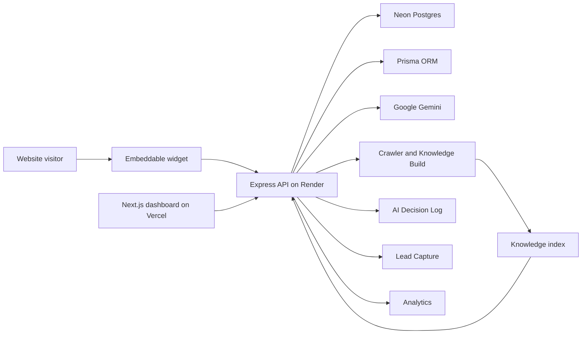

# AI Revenue Employee

AI Revenue Employee is an embeddable AI sales assistant for SaaS and service businesses. It learns from a website, watches visitor behavior through a lightweight widget, starts helpful conversations at the right moment, captures leads, and gives teams a dashboard for analytics, website actions, and AI decision logs.

The project is designed as a production-ready v1.0 SaaS foundation: a Next.js dashboard, an Express/Prisma backend, a PostgreSQL data layer, Google Gemini for generation and embeddings, and a standalone JavaScript widget that can run on customer websites.

## Features

- Guided onboarding for adding websites and configuring the assistant.
- Knowledge Build pipeline for crawling a site and preparing retrieval context.
- AI Chat with business-aware responses grounded in website knowledge.
- Website Actions that identify useful CTAs and route visitors to the right page.
- Lead Capture for high-intent visitors and inline contact collection.
- Analytics for conversations, engagement, behavior, and conversion signals.
- AI Decision Log for inspecting why the assistant showed a popup or took an action.
- Embeddable widget built as a framework-independent JavaScript bundle.
- Multi-tenant backend architecture based on website and origin resolution.
- Production deployment path for Vercel, Render, and Neon.

## Architecture



## Tech Stack

| Area | Technology |
| --- | --- |
| Dashboard | Next.js 16, React 19, TypeScript, Tailwind CSS |
| Backend | Node.js, Express, TypeScript |
| Database | PostgreSQL, Prisma |
| AI | Google Gemini generation and embedding models |
| Widget | TypeScript, esbuild, browser IIFE bundle |
| Deployment | Vercel dashboard, Render API, Neon Postgres |

## How It Works

1. A business adds its website in the dashboard and completes onboarding.
2. The backend crawls the website and builds a knowledge snapshot for retrieval.
3. The business installs the widget script on its website.
4. The widget observes visitor behavior such as scroll, time on page, page visits, and intent signals.
5. The backend evaluates whether to show a popup, answer a chat message, capture a lead, or recommend a website action.
6. The dashboard shows analytics, leads, conversations, configured actions, and AI decision traces.

## Project Structure

```text
.
|-- backend/                 # Express API, Prisma schema, AI, crawler, analytics, leads
|   |-- prisma/              # Database schema and migrations
|   |-- src/                 # Backend source modules
|   `-- RENDER_DEPLOYMENT.md # Render deployment notes
|-- dashboard/               # Next.js dashboard application
|   `-- src/app/             # App Router pages and layouts
|-- widget/                  # Embeddable browser widget source
|   `-- src/                 # Analytics, chat, popup, sensors, orchestration
|-- docs/                    # Architecture notes and implementation walkthroughs
|-- RELEASE_CHECKPOINT.md    # v1 deployment checkpoint
`-- README.md
```

## Local Development

Prerequisites:

- Node.js 20 or newer.
- npm.
- PostgreSQL database, ideally Neon for production parity.
- Google Gemini API key.

Install dependencies:

```bash
cd backend
npm install

cd ../dashboard
npm install

cd ../widget
npm install
```

Configure backend environment:

```bash
cd backend
cp .env.example .env
```

Run database setup:

```bash
cd backend
npm run prisma:generate
npm run prisma:migrate
```

Run the services:

```bash
# Terminal 1
cd backend
npm run dev

# Terminal 2
cd dashboard
npm run dev

# Terminal 3, rebuild widget when needed
cd widget
npm run watch
```

Build for production:

```bash
cd backend && npm run build
cd ../dashboard && npm run build
cd ../widget && npm run build
```

## Environment Variables

The backend environment is documented in [backend/.env.example](backend/.env.example). Production requires:

| Variable | Purpose |
| --- | --- |
| `NODE_ENV` | Runtime mode. Use `production` in deployed environments. |
| `PORT` | API server port. Render usually provides this automatically. |
| `DATABASE_URL` | PostgreSQL connection string. |
| `GEMINI_API_KEY` | Google Gemini API key. |
| `GEMINI_MODEL` | Generation model, for example `gemini-2.5-flash`. |
| `EMBEDDING_MODEL` | Embedding model for knowledge retrieval. |
| `SESSION_SECRET` | Secret used to sign session cookies. |
| `SESSION_TTL_DAYS` | Session lifetime. |
| `FRONTEND_URL` | Public dashboard URL. |
| `LANDING_PAGE_URL` | Optional public landing page URL. |
| `DASHBOARD_ORIGIN` | Dashboard origin for auth and CORS. |
| `WIDGET_BASE_URL` | Public API origin used in generated widget snippets. |
| `CORS_ORIGIN` | Comma-separated production allowlist. |
| `RETRIEVAL_TOP_K` | Number of knowledge chunks retrieved for AI context. |
| `RETRIEVAL_MIN_SCORE` | Minimum retrieval relevance score. |
| `RETRIEVAL_MAX_CONTEXT_CHARS` | Maximum retrieved context sent to the model. |
| `KNOWLEDGE_DIR` | Local knowledge storage directory. |
| `KNOWLEDGE_SNAPSHOT_PATH` | Knowledge index file path. |
| `CRAWL_MAX_PAGES` | Maximum pages crawled per website. |
| `CRAWL_CONCURRENCY` | Crawler concurrency. |
| `CRAWL_TIMEOUT_MS` | Per-page crawl timeout. |
| `DEBUG_TRACE` | Enables verbose debug traces when set to `true`. |

## Deployment Overview

### Vercel

Deploy `dashboard/` as the frontend application. Configure the dashboard to call the Render API URL and allow that dashboard origin in backend CORS settings.

### Render

Deploy `backend/` as the API service. Use `npm install`, `npm run build`, `npm run prisma:migrate:deploy`, and `npm start` according to your Render service setup. Add all required environment variables in Render, especially `DATABASE_URL`, `GEMINI_API_KEY`, `SESSION_SECRET`, `FRONTEND_URL`, `DASHBOARD_ORIGIN`, `WIDGET_BASE_URL`, and `CORS_ORIGIN`.

### Neon

Create a Neon PostgreSQL database and use its pooled or direct connection string as `DATABASE_URL`. Ensure SSL is required when Neon provides a TLS-enabled connection string.

## Screenshots

Add production screenshots here after deployment:

- Dashboard overview
- Guided onboarding
- Knowledge Build
- AI Chat
- Lead Capture
- Website Actions
- Analytics
- AI Decision Log
- Embedded widget on a customer website

## Developer Documentation

- [Developer Guide](docs/DEVELOPER_GUIDE.md)
- [Contributing](CONTRIBUTING.md)
- [Changelog](CHANGELOG.md)
- [Render Deployment](backend/RENDER_DEPLOYMENT.md)

## GitHub Presentation

Recommended repository description:

> Embeddable AI sales assistant with website knowledge, proactive chat, lead capture, analytics, and a SaaS dashboard.

Recommended topics:

```text
ai-sales-assistant
ai-chatbot
saas
lead-generation
website-widget
nextjs
react
express
typescript
prisma
postgresql
neon
render
vercel
gemini
rag
analytics
```

## Future Roadmap

- Team roles, permissions, and workspace billing.
- More CRM and email integrations.
- Visual widget customization from the dashboard.
- A/B testing for popups, CTAs, and lead capture flows.
- Multi-provider LLM support.
- Advanced conversation quality scoring.
- Exportable analytics and scheduled reports.
- Hosted public status and uptime monitoring.

## License

No open-source license has been selected yet. Until a license is added, all rights are reserved by the repository owner.
