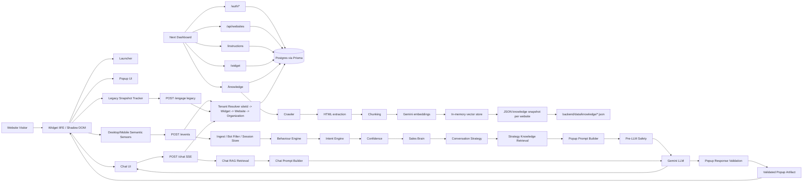

# Technical Audit Before Sprint 5

Date: 2026-07-07
Scope: Complete project audit based on the actual implementation in `backend`, `widget`, `dashboard`, database schema, tests, and supporting docs.

This report is intentionally blunt. It does not assume features that are not present in code.

## Verification Performed

- Backend typecheck: passed.
- Backend tests: passed, `64/64`.
- Backend build: passed.
- Widget typecheck: passed.
- Widget build: passed after sandbox approval.
- Dashboard production build: passed after sandbox approval.
- Dashboard lint: failed.

Dashboard lint failures:

- `dashboard/src/app/(dashboard)/websites/[id]/page.tsx`: unused `instructions` state.
- `dashboard/src/app/(dashboard)/websites/[id]/page.tsx`: React lint error for synchronous `setBuildUrl(websiteUrl)` inside an effect.

Additional verification note:

- Backend tests initially failed in the sandbox with `spawn EPERM`; they passed when run outside the sandbox.
- Dashboard and widget builds also hit sandbox/Windows artifact restrictions first, then passed when run outside the sandbox.

---

# 1. High Level Architecture

The project is split into three primary applications:

- `widget`: embeddable website widget compiled into a browser IIFE.
- `backend`: Express API, AI pipeline, RAG pipeline, auth, tenant, knowledge, and dashboard APIs.
- `dashboard`: Next.js control plane for account, websites, instructions, widget install, and knowledge builds.

The current architecture:



## Widget

The widget lives in `widget/src`. It compiles into `backend/public/widget.js` through `widget/esbuild.config.mjs`.

Current widget responsibilities:

- Read script tag config from `data-site-id`, `data-backend`, `data-debug`, `data-legacy-engagement`.
- Mount a Shadow DOM root.
- Show persistent launcher.
- Open/close chat.
- Stream chat replies from `/chat`.
- Render source attribution buttons.
- Run semantic event sensors by default.
- Send batched events to `/events`.
- Receive validated popup artifacts from `/events`.
- Render generated popups.
- Preserve local popup suppression state.
- Optionally run legacy `/engage` snapshot engagement when explicitly enabled.

## Dashboard

The dashboard is a Next.js app under `dashboard/src`.

Current dashboard responsibilities:

- Signup.
- Login.
- Logout.
- Client auth context.
- Cookie-presence route middleware.
- Website list/create/detail.
- Business instruction form.
- Widget install snippet view.
- Knowledge build/status UI.

It is not currently an operational SaaS dashboard. It does not expose analytics, lead management, conversations, CRM, handoff, billing, team settings, or audit views.

## Backend

The backend is an Express server under `backend/src`.

Current backend responsibilities:

- Public widget APIs:
  - `/events`
  - `/engage`
  - `/chat`
  - `/ingest`
  - `/debug/rag`
- Static serving:
  - `/widget.js`
  - `/playground.html`
  - `/wp-test.html`
- Dashboard APIs:
  - `/auth/*`
  - `/api/websites`
  - `/api/websites/:id/instructions`
  - `/api/websites/:id/widget`
  - `/api/websites/:id/knowledge/*`
- Tenant resolution.
- Auth/session handling.
- Knowledge build orchestration.
- RAG retrieval.
- LLM prompting.
- Sprint 4 intelligence pipeline.

## Knowledge Base

Knowledge base implementation is functional but MVP-level.

Pipeline:

```text
URL
-> crawl same-origin pages
-> fetch static HTML
-> fallback to Chrome/Edge rendering for sparse pages
-> extract readable text
-> chunk pages
-> embed chunks with Gemini
-> index in in-memory vector store
-> persist JSON snapshot to disk
-> record KnowledgeSnapshot / KnowledgeBuild rows in Postgres
```

Storage:

- Metadata in Postgres.
- Vectors in JSON snapshot files on local disk.
- Active indexes in process memory.

This is not production-grade vector infrastructure.

## RAG

RAG currently works through:

- Query construction.
- Query embedding via Gemini.
- Linear cosine search over the memory vector store.
- Similarity threshold filtering.
- Context character budget.
- Prompt injection boundary through prompt wording.

Limitations:

- No vector DB.
- No ANN index.
- No query embedding cache.
- No reranker.
- No per-section permissioning.
- No knowledge review workflow.

## Tenant System

Tenant ownership chain:

```text
Widget.siteId -> Widget.websiteId -> Website.organizationId -> Organization
```

Dashboard APIs use cookie auth and organization-scoped queries.

Public widget APIs use `siteId` to resolve tenant context.

Important gap:

- `widgetPublicKey` exists but is not verified.
- Public widget requests are not origin-signed.
- A valid `siteId` is enough to call public widget APIs.

## Popup Pipeline

Production `/events` pipeline:

```text
Widget semantic events
-> POST /events
-> envelope validation
-> tenant resolution
-> event quality validation
-> bot filtering
-> server-side visitor session
-> Behaviour Engine
-> Intent Engine
-> Confidence
-> Sales Brain
-> client suppression checks
-> Conversation Strategy
-> Strategy-aware RAG retrieval
-> Pre-LLM Safety
-> Popup Prompt Builder
-> Gemini structured output
-> Response Validation
-> Popup Artifact
-> widget renders popup
-> CTA opens chat with popup body as opener
```

This is implemented.

## Chat Pipeline

```text
Widget chat
-> POST /chat
-> tenant resolution
-> get latest user message
-> RAG retrieval
-> prompt build
-> Gemini stream
-> SSE token stream
-> widget renders text
-> optional source attribution event
```

Chat is functional but has no persisted conversation store, no lead capture, no human handoff, and no post-generation validator.

## Database

Prisma/Postgres schema includes:

- `User`
- `Organization`
- `OrganizationMember`
- `Session`
- `PasswordResetToken`
- `Website`
- `BusinessInstruction`
- `Widget`
- `KnowledgeSnapshot`
- `KnowledgeBuild`
- `AuditLog`

Database supports the SaaS foundation, but several fields are unused or underused.

## LLM

The LLM abstraction exists:

- Provider interface: `backend/src/llm/provider/types.ts`
- Current implementation: Gemini only.
- Uses Gemini for:
  - structured popup/engage decisions
  - streaming chat
  - embeddings

Provider abstraction is good. Provider diversity is not implemented.

## Crawler

Crawler implementation:

- BFS.
- Same-origin only.
- Page cap.
- Concurrency.
- Request timeout.
- Static fetch first.
- Browser render fallback through Chrome DevTools Protocol.
- URL normalization.
- Tracking-param stripping.
- Path exclusions.

Missing:

- SSRF protections.
- robots.txt support.
- crawl scheduling.
- crawl queue.
- retry policy.
- authenticated crawl.
- incremental recrawl.
- sitemap-first crawl.

## Embeddings

Embeddings use Gemini `gemini-embedding-001`.

Document chunks use document task type.

Queries use query task type.

No caching or batching beyond provider batch handling.

## Vector Search

Vector search is in memory:

- L2-normalized vectors.
- Cosine via dot product.
- Linear scan.
- Top-K.
- Threshold.

This is acceptable for small demos, not production SaaS scale.

---

# 2. Current Features

## Widget

Works:

- Launcher.
- Shadow DOM isolation.
- Chat panel.
- Chat minimize/reopen.
- Chat history within widget instance.
- SSE chat streaming.
- Typing indicator.
- Source attribution button.
- Popup renderer.
- Popup title/body/CTA support.
- Popup dismiss.
- Popup CTA opens chat.
- Popup CTA can navigate when `ctaUrl` exists in legacy flow.
- Mobile responsive styling.
- Dark mode via `prefers-color-scheme`.
- Reduced motion support.
- Desktop semantic sensors.
- Mobile semantic sensors.
- Session ID through `sessionStorage`.
- Returning token through `localStorage`.
- Bot signal via `navigator.webdriver`.
- `/events` batching.
- Pagehide/visibility flush.
- Legacy `/engage` path opt-in.
- Client-side suppression state.

## Dashboard

Works:

- Signup form.
- Login form.
- Logout.
- Auth context.
- Cookie-presence middleware.
- Website list.
- Website create.
- Website detail.
- Instruction get/update.
- Widget snippet view.
- Widget status display.
- Knowledge status display.
- Knowledge build trigger.
- Knowledge build progress display, with caveat on event-name mismatch.

## Backend

Works:

- Express server.
- Health route.
- Static widget serving.
- Public widget APIs.
- Dashboard auth APIs.
- Dashboard resource APIs.
- Zod validation.
- Central error handler.
- Prisma client singleton.
- Audit log helper.
- Tenant resolver.
- Tenant cache.
- Origin snapshot emergency resolver for chat fallback.
- Cookie sessions stored as token hashes.
- Password hashing.
- Organization-scoped website access.

## Knowledge Base

Works:

- Crawl.
- Extract.
- Chunk.
- Embed.
- Index.
- Persist snapshot.
- Load snapshot.
- Per-website stores.
- Global dev fallback store.
- Snapshot compatibility checks.
- Site link derivation.
- Knowledge build metadata.
- Knowledge build history.
- SSE build progress.

## RAG

Works:

- Query embedding.
- Cosine search.
- Top-K.
- Thresholding.
- Character budget.
- Tenant no-global-fallback guard.
- Static fallback for dev/no tenant.
- Source metadata included in chunks.

## Chat

Works:

- SSE streaming.
- RAG answers.
- Popup opener lifted into prompt context.
- Source-attribution shortcut.
- Source UI.
- Provider-failure fallback if no token emitted.
- Tenant fail-closed behavior when `siteId` exists but tenant is unavailable.

## Popup

Works:

- Semantic event ingest.
- Bot filtering.
- Server-side visitor session in memory.
- Behaviour Engine.
- Intent Engine.
- Confidence scoring.
- Sales Brain.
- Conversation strategy.
- Strategy RAG retrieval.
- Pre-LLM safety gate.
- Popup prompt builder.
- Gemini structured popup language.
- Timeout handling.
- Response validation.
- Invented pricing/guarantee/feature claim rejection.
- Discount policy rejection.
- Final popup artifact generation.
- Production `/events` response includes popup artifact.
- Widget renders popup artifact.
- Widget suppression prevents repeated popups.

## Tests

Works:

- Backend test suite has 64 tests.
- Tests cover:
  - context tenant fallback guard
  - event quality
  - bot filter
  - perception scenarios
  - conversation strategy
  - knowledge retrieval
  - safety layer
  - popup LLM adapter
  - response validation
  - popup generation
  - popup prompt builder
  - origin snapshot tenant resolver

---

# 3. Sprint Progress

## Sprint 1

Status: Mostly complete.

Completed:

- Widget.
- Launcher.
- Popup renderer.
- Chat.
- `/engage`.
- `/chat`.
- Rules engine.
- Behaviour snapshot tracking.
- Gemini structured decision.
- Response validation.
- Widget-side session counters.

Partially completed:

- Production readiness. Sprint 1 code exists, but the current default path disables legacy `/engage` automation unless `data-legacy-engagement="true"` is set.

Missing:

- Server-side session persistence for legacy `/engage`.
- Production-grade rate limiting.

Why:

- The old Sprint 1 flow remains, but Sprint 4 supersedes it with `/events`.

## Sprint 2

Status: Mostly complete for MVP RAG.

Completed:

- Crawler.
- Extraction.
- Chunking.
- Embedding.
- In-memory vector search.
- Snapshot persistence.
- RAG context provider.
- Chat RAG.
- Engage RAG.
- Source metadata.

Partially completed:

- Knowledge management. Dashboard can build and view status, but cannot inspect, approve, edit, upload, or schedule knowledge.
- Vector infrastructure. Functional but in-memory and file-backed.

Missing:

- Production vector DB.
- Incremental recrawling.
- File/document upload.
- Sitemap ingestion.
- robots.txt handling.
- RAG poisoning controls.

Why:

- The implementation proves the RAG loop, not a production knowledge platform.

## Sprint 3

Status: Partially complete.

Completed:

- Postgres schema.
- Prisma migrations.
- Signup/login/logout/me.
- DB-backed sessions.
- Organizations.
- Organization members.
- Website CRUD.
- Business instructions.
- Widget identity.
- Knowledge build metadata.
- Dashboard shell.
- Auth middleware.
- Tenant resolver.

Partially completed:

- Multi-tenant SaaS foundation. Ownership checks exist for dashboard APIs, but public widget identity is only `siteId`.
- Role system. `MemberRole` exists, but role enforcement and team management are not implemented.
- Password reset. Schema and routes exist, but routes return `501`.

Missing:

- Email verification.
- Password reset implementation.
- Team invite/member management.
- Billing.
- Subscription enforcement.
- Widget domain verification.
- Installed-state verification.
- Admin audit UI.

Why:

- The database and API foundation exists, but product/account lifecycle is not complete.

## Sprint 4.1

Status: Mostly complete.

Completed:

- Semantic event schema.
- Widget desktop/mobile sensors.
- Batched `/events`.
- Ingest validation.
- Event quality checks.
- Bot filtering.
- Server-side visitor session store.
- Behaviour Engine.
- Intent Engine.
- Confidence system.
- Sales Brain.
- Reason trace.
- Golden scenario tests.

Partially completed:

- Server-side session store is in memory only.
- Widget zone resolution has heuristic support and a `setZoneMap` seam, but no backend-served crawl-derived zone map is actually wired.
- Docs/comments still describe 4.1 as shadow-only in places, while production popup wiring now exists.

Missing:

- Persistent visitor session store.
- Analytics observer port.
- Crawl-derived zone map served to widget.

Why:

- The perception spine is real and tested, but production persistence and observability are not there.

## Sprint 4.2

Status: Mostly complete.

Completed:

- Conversation Strategy.
- Strategy-aware Knowledge Retrieval.
- Popup Prompt Builder.
- Pre-LLM Safety Layer.
- Popup LLM Adapter.
- Response Validation.
- Popup Generation.
- Safe composed popup pipeline.
- Production `/events` bridge to popup generation.
- Widget consumes popup artifacts.
- Backend tests for the pipeline.

Partially completed:

- Business Goal layer is minimal. It uses `alwaysBookDemo` to decide between `book_demo` and `collect_lead`.
- CTA/tone library exists in code as strategy mapping, not as tenant-configurable vertical presets.
- Server-side cooldown/frequency exists only in memory.

Missing:

- Vertical presets.
- Config clamps exposed to dashboard.
- Business goal configuration.
- Rich CTA/action ports.

Why:

- The safe "mouth" exists, but the configurable SaaS/product layer around it does not.

## Sprint 4.3

Status: Mostly missing.

Completed:

- Chat can be seeded with popup body.

Partially completed:

- Popup context flows into chat only as assistant opener text. The full reason trace does not flow into chat prompt context.

Missing:

- Conversation handoff with reason trace.
- Mid-conversation intent re-detection.
- Support/sales rerouting.
- Observer events.
- Analytics sink.
- Prompt-injection adversarial suite.
- Bot replay proving zero LLM calls.

Why:

- Code does not implement the continuity/metrics layer described by the architecture docs.

## Sprint 4.4

Status: Missing / undefined in code.

Completed:

- None identifiable as a 4.4 milestone.

Partially completed:

- None identifiable as a 4.4 milestone.

Missing:

- No explicit 4.4 implementation target exists in the codebase.

Why:

- Sprint docs define 4.1 through 4.3. The user requested 4.4, but the implementation does not contain a named 4.4 slice.

## Sprint 4.5

Status: Missing / undefined in code.

Completed:

- None identifiable as a 4.5 milestone.

Partially completed:

- None identifiable as a 4.5 milestone.

Missing:

- No explicit 4.5 implementation target exists in the codebase.

Why:

- Sprint docs define 4.1 through 4.3. The implementation does not contain a named 4.5 slice.

---

# 4. AI Pipeline

## Semantic Events

Purpose:

- Convert raw browser behavior into low-rate semantic signals.

Inputs:

- Mouse movement, hover, clicks, scroll, touch, form focus/input, visibility, history/back events.

Outputs:

- `SemanticEvent[]` with `type`, `zone`, `intensity`, `ts`, `surface`.

Implementation status:

- Implemented in widget sensors.
- Uses heuristic zone resolution.
- Backend-served zone map is not wired.

## Behaviour

Purpose:

- Infer how the visitor is acting.

Inputs:

- Semantic events and current monotonic session time.

Outputs:

- Weighted behaviour vector, dominant state, trajectory, stability.

Implementation status:

- Implemented and tested.

## Intent

Purpose:

- Infer visitor goal and readiness.

Inputs:

- Behaviour state.
- Returning flag.

Outputs:

- Goal, readiness, alternatives, conflict flag, reason.

Implementation status:

- Implemented and tested.

## Sales Brain

Purpose:

- Decide whether speaking is earned.

Inputs:

- Behaviour.
- Intent.
- Confidence.
- Perception context.
- Business objective.
- Surface.
- Knowledge availability.

Outputs:

- `SalesDecision` with `action`, `speakScore`, suppression reason, `because`, and trace.

Implementation status:

- Implemented and tested.
- State persistence is in-memory.

## Strategy

Purpose:

- Convert a speak decision into communication strategy.

Inputs:

- Sales decision.
- Business objective.

Outputs:

- Strategy kind, tone, CTA intent, reason, safe visitor summary.

Implementation status:

- Implemented and tested.

## Knowledge

Purpose:

- Retrieve relevant business facts for the strategy/chat.

Inputs:

- Strategy or latest user message.
- Website ID.

Outputs:

- Relevant chunks, scores, source metadata.

Implementation status:

- Implemented.
- Limited by in-memory/vector-file storage.

## Prompt

Purpose:

- Build constrained prompts for engage, chat, and popup generation.

Inputs:

- Context, instructions, chunks, strategy, behaviour summaries.

Outputs:

- System/user prompts and JSON schema where applicable.

Implementation status:

- Implemented.

## Safety

Purpose:

- Prevent invalid or unsafe LLM calls/output.

Inputs:

- Decision, strategy, knowledge, instructions.

Outputs:

- Safety pass/fail.
- Validated popup language or suppression.

Implementation status:

- Implemented for popup pipeline.
- Chat lacks post-generation safety validation.

## LLM

Purpose:

- Generate text or structured JSON and embeddings.

Inputs:

- Provider-neutral structured/stream/embed requests.

Outputs:

- Parsed JSON, streaming text, embedding vectors.

Implementation status:

- Gemini implemented.
- Other providers not implemented.

## Validation

Purpose:

- Treat model output as untrusted.

Inputs:

- Raw model output.

Outputs:

- Safe decision or safe popup artifact.

Implementation status:

- Legacy engage validation implemented.
- Popup validation implemented.
- Chat validation missing.

## Popup

Purpose:

- Visitor-facing proactive prompt only after deterministic decision and validation.

Inputs:

- Validated popup artifact.

Outputs:

- Popup UI.

Implementation status:

- Implemented in production widget.

## Chat

Purpose:

- Continue conversation after launcher or popup CTA.

Inputs:

- User messages, opener, behaviour snapshot, RAG context.

Outputs:

- SSE tokens and optional source events.

Implementation status:

- Implemented.
- No persistent conversation memory.
- No human handoff.
- No lead capture.

---

# 5. Folder-by-folder Review

## `backend/src/intelligence`

Core Sprint 4 intelligence.

Responsible for:

- Behaviour engine.
- Intent engine.
- Confidence.
- Sales Brain.
- Conversation strategy.
- Strategy-aware knowledge retrieval.
- Safety.
- Popup LLM adapter.
- Popup response validation.
- Popup generation.
- Safe popup pipeline.
- Visitor session store.
- Event quality and bot filter.

## `backend/src/crawler`

Website crawler.

Responsible for:

- URL normalization.
- Same-origin crawl.
- Static fetch.
- Browser-render fallback.
- HTML extraction.
- Link derivation.
- Page classification.

## `backend/src/chunking`

Text chunking.

Responsible for:

- Natural block/paragraph chunking.
- Heading association.
- Chunk hashes.
- Language metadata.

## `backend/src/embeddings`

Embedding wrapper.

Responsible for:

- Embedding chunks as documents.
- Embedding queries as queries.

## `backend/src/vectorstore`

Vector index and persistence.

Responsible for:

- In-memory cosine search.
- Global fallback store.
- Per-website store registry.
- JSON snapshot save/load.
- LRU store eviction.

## `backend/src/context`

Context provider.

Responsible for:

- Business instruction loading.
- Static fallback context.
- RAG retrieval boundary.
- Tenant context assembly.

## `backend/src/prompts`

Prompt builders.

Responsible for:

- Engage prompt.
- Chat prompt.
- Popup prompt.
- Shared rendering of knowledge, instructions, site links.

## `backend/src/llm`

LLM provider abstraction.

Responsible for:

- Gemini structured output.
- Gemini streaming text.
- Gemini embeddings.

## `backend/src/routes`

Public widget/dev routes.

Responsible for:

- `/engage`
- `/chat`
- `/events`
- `/ingest`
- `/debug/rag`

## `backend/src/services`

Route orchestration.

Responsible for:

- Legacy engage service.
- Chat service.
- Knowledge ingestion service.
- Perception ingest service.

## `backend/src/auth`

Authentication.

Responsible for:

- Signup.
- Login.
- Logout.
- Auth middleware.
- Password hashing.
- Session resolution.

## `backend/src/tenant`

Tenant resolution.

Responsible for:

- Mapping `siteId` to tenant context.
- Cache invalidation.
- Origin-snapshot fallback for chat.

## `backend/src/websites`

Website CRUD.

Responsible for:

- Org-scoped website list/get/create/update/delete.

## `backend/src/instructions`

Business instructions.

Responsible for:

- Get/create/update instructions.
- Audit logging instruction updates.

## `backend/src/widgets`

Widget identity.

Responsible for:

- Create/get widget.
- Generate `siteId`.
- Generate unused `widgetPublicKey`.
- Build install snippet.

## `backend/src/knowledge`

Knowledge dashboard API.

Responsible for:

- Start knowledge builds.
- Stream build phases.
- Create snapshot/build records.
- Report status/history.

## `widget/src/core`

Widget state machine.

Responsible for:

- Mount UI.
- Start sensors.
- Optional legacy engagement.
- Popup/chat/launcher orchestration.
- Client suppression rules.

## `widget/src/sensors`

Semantic event edge.

Responsible for:

- Desktop sensors.
- Mobile sensors.
- Zone resolution.
- Session identity.
- Event batching.

## `widget/src/chat`

Chat UI.

Responsible for:

- Conversation history.
- Message rendering.
- Streaming reply handling.
- Source UI.

## `widget/src/popup`

Popup UI.

Responsible for:

- Rendering generated popup artifact.
- Dismiss and CTA callbacks.

## `widget/src/tracker`

Legacy behaviour snapshot.

Responsible for:

- Old `/engage` path.
- Scroll/click/form/exit intent aggregation.

## `dashboard/src/app`

Next app routes.

Responsible for:

- Auth pages.
- Dashboard layout.
- Website list/detail.

## `dashboard/src/lib`

Dashboard client logic.

Responsible for:

- API client.
- Auth context.

## `dashboard/src/components`

UI components.

Responsible for:

- Button.
- Input.
- Card.
- Badge.
- Spinner.
- Empty state.

Issue:

- Duplicate component implementations exist.

---

# 6. Technical Debt

## Duplicated Logic

- Dashboard UI components exist in both:
  - `dashboard/src/components/ui.tsx`
  - `dashboard/src/components/ui/*`
- Legacy `/engage` and new `/events` implement separate proactive engagement paths.
- Widget has both legacy `tracker` and Sprint 4 `sensors`.
- Popup suppression exists on both backend and widget.

Some duplication is intentional for migration, but it needs cleanup.

## Dead / Underused Code

- `widgetPublicKey` exists but is not verified.
- `SESSION_SECRET` is configured but unused.
- `BusinessInstruction` fields like `companyDescription`, `role`, `goal`, `context`, `rules`, `fallbackMessage`, `preferredCta`, `supportEmail`, `supportPhone`, `websiteUrl`, `allowedLinks` are stored but mostly not used by tenant prompt resolution.
- `setZoneMap()` exists but no served zone map is wired.
- `/auth/forgot` and `/auth/reset` are stubs.

## Legacy Code

- `/engage` snapshot pipeline.
- `backend/src/context/staticContext.ts` hardcoded Creovix context.
- `backend/config/business-instructions.json`.
- README still presents Sprint 1 architecture.

## Temporary / Debug Code

- `backend/public/playground.html`.
- `backend/public/wp-test.html`.
- `cross-origin-test`.
- Extensive chat logs print prompts, retrieved chunks, raw Gemini chunks, and final responses.
- Dev debug traces in `/events` and `/engage`.

## Architecture Smells

- In-memory visitor sessions.
- In-memory vector stores.
- JSON file vector persistence.
- Public unauthenticated `/ingest`.
- Public widget identity is only `siteId`.
- CORS configuration is too broad.
- No rate limiting.
- Dashboard middleware only checks cookie presence, not validity, before routing.
- Knowledge builds run as in-process background tasks, not jobs.

---

# 7. Security Review

## API Key Leaks

No committed real API keys were found.

`.env.example` contains placeholders only.

## Tenant Isolation

Strengths:

- Dashboard website operations are organization-scoped.
- `assertWebsiteOwnership()` prevents cross-org website access.
- Tenant RAG does not fall back to global static context when website knowledge is unavailable.

Weaknesses:

- Public widget APIs rely on `siteId`.
- `widgetPublicKey` is not used.
- Origin/domain verification is not implemented.
- Public requests are not signed.

## Prompt Injection

Strengths:

- Prompt builders separate instructions and knowledge.
- Popup response validation rejects many unsupported claims.
- CTA URLs are allowlisted in legacy engage validation.

Weaknesses:

- RAG content remains untrusted crawled website content.
- Chat stream has no response validator.
- No adversarial prompt-injection test suite.
- Chat prompt relies heavily on instruction wording.

## RAG Poisoning

Risk exists.

Reasons:

- The crawler ingests public website content into prompt context.
- No knowledge review/approval.
- No source trust scoring.
- No detection of prompt injection text in crawled content.
- No admin UI to remove poisoned chunks.

## XSS / HTML Injection

Strengths:

- Widget renders model/user text with `textContent`.
- Popup model text uses `textContent`.
- Chat model text uses `textContent`.
- Static SVGs are the only `innerHTML` in widget UI.

Weaknesses:

- Dev playground uses `innerHTML`, but it escapes most dynamic values.
- Source links open URLs from retrieved chunk metadata. They originate from crawled URLs but should still be sanitized/normalized on the way out.

## Authentication Gaps

- No CSRF protection.
- Cookie auth with broad CORS is dangerous.
- No email verification.
- No password reset.
- No login rate limiting.
- No account lockout.
- No MFA.
- No role enforcement.
- No invite flow.

## CORS / CSRF Concern

Major issue:

`backend/src/middleware/cors.ts` sets `credentials: true` globally while allowing any origin if `CORS_ORIGIN=*`.

In production, cookies are set as `SameSite=None` and `secure=true`.

This combination can expose dashboard APIs to cross-site credentialed requests unless browsers reject the wildcard-like reflected origin scenario in all cases. It should be fixed deliberately.

## SSRF / Crawl Abuse

Major issue:

- Public `/ingest` accepts arbitrary URLs.
- Dashboard knowledge build also crawls arbitrary URL input.
- Crawler has no private IP denylist.
- No DNS rebinding protection.
- No metadata IP block.
- No rate limit.
- No auth on public `/ingest`.

This is not safe for production.

---

# 8. Performance Review

## Unnecessary LLM Calls

- Popup pipeline gates before LLM, which is good.
- Chat calls Gemini for every user turn.
- Query embedding occurs per chat turn.
- No caching for repeated queries.
- Legacy `/engage` can still call LLM when enabled.

## Slow Crawler Paths

- Browser render starts a Chrome/Edge process per sparse page.
- No shared browser pool.
- No queue.
- No sitemap prioritization.
- No incremental page skip despite hashes being stored.

## Repeated DB Queries

- Ownership is asserted and then resource is fetched again in some routes.
- Knowledge status uses two queries, acceptable for now.
- Tenant cache reduces public widget DB lookups.

## Unnecessary Embeddings

- Query embeddings are not cached.
- Full rebuild always re-embeds all chunks.
- Chunk hashes exist but are not used for incremental embedding.

## Memory Leaks / State Risks

- Visitor sessions are in memory.
- Vector stores are in memory with LRU cap.
- Widget sensors do not appear to have a full orchestrator teardown path.
- Chat history persists only in the widget instance and can grow up to backend schema max when sent.

## Widget Performance

Good:

- Batched semantic events.
- Throttled mouse/scroll.
- Max mobile observed elements.
- Shadow DOM scoping.

Risks:

- Mobile `observeZones()` runs every 5 seconds.
- IntersectionObserver can observe many elements on large pages.
- Debug logging can be noisy.

## Browser Rendering Cost

- Headless browser rendering is expensive.
- Per-page browser spawn is not scalable.
- Local Chrome dependency is operationally fragile.

## Improvements

Critical:

- Add query embedding cache.
- Add job queue for knowledge builds.
- Use pgvector or a managed vector DB.
- Make crawling asynchronous and rate-limited.
- Add incremental recrawl using stored hashes.
- Add persistent Redis/Postgres visitor sessions.

High:

- Replace per-page Chrome spawn with a browser pool.
- Add crawler SSRF protections.
- Reduce chat debug logging.
- Add observability metrics around LLM calls and retrieval latency.

---

# 9. Product Readiness

| Area | Readiness | Reason |
|---|---:|---|
| Knowledge Base | Needs Work | Build works, but no review, upload, schedule, or production vector DB. |
| Widget | Needs Work | Core works, but no verified install/origin security and limited lifecycle controls. |
| Dashboard | Needs Work | Thin control plane; lint fails; many SaaS surfaces absent. |
| Crawler | Needs Work | Functional but lacks SSRF protections, queue, robots, incremental crawl. |
| Chat | Needs Work | Works, but no persistence, handoff, lead capture, or validator. |
| Popup | Needs Work | AI popup pipeline is strong, but not yet measured or tuned in product loops. |
| Analytics | Missing | No analytics sink/dashboard. |
| Lead Capture | Missing | No lead entity or capture workflow. |
| Conversation Memory | Needs Work | In-widget instance history only; no DB memory. |
| CRM | Missing | No integrations. |
| Human Handoff | Missing | No escalation path. |
| Billing | Missing | No billing/subscription enforcement. |

---

# 10. Missing Features Before Sellable SaaS

## Critical

- Fix CORS/credential behavior.
- Add CSRF protection.
- Protect `/ingest`.
- Add SSRF protections to crawler.
- Add widget origin/domain verification.
- Actually use `widgetPublicKey` or signed requests.
- Add rate limiting.
- Add persistent visitor session store.
- Move vectors to pgvector or managed vector DB.
- Add background job queue for knowledge builds.
- Stop logging full prompts/chunks/responses in production-like environments.
- Add production deployment configuration.
- Add conversation persistence.
- Add lead model and lead capture.

## High

- Dashboard lint fix.
- Knowledge SSE event-name mismatch fix.
- Email verification.
- Password reset.
- Team/member management.
- Role enforcement.
- Analytics events and basic dashboard.
- Widget install verification.
- Knowledge review/edit/delete.
- Crawl scheduling.
- Incremental recrawl.
- Chat safety validator.
- Reason trace handoff into chat.
- Prompt injection test suite.
- Bot replay tests.
- Error monitoring.

## Medium

- Vertical presets.
- Business goal configuration.
- CTA/action port configuration.
- Source management UI.
- Better chat UX controls.
- Conversation search.
- Audit log UI.
- Admin settings page.
- Environment-specific logging.
- Public docs update.
- Customer onboarding checklist.

## Low

- A/B testing.
- Learned scoring model.
- CRM integrations.
- Calendar booking adapters.
- WhatsApp adapters.
- Voice adapters.
- Billing portal.
- Advanced replay simulator.
- Multi-provider LLM routing.

---

# 11. Bugs, Potential Bugs, Risks

## Known Bugs / Failures

- Dashboard lint fails.
- Dashboard knowledge SSE handler expects `complete` / `error`, but backend emits `build:complete` / `build:error` / `build:done`.
- Dashboard nav includes `/settings`, but no settings page exists.
- README is stale and describes Sprint 1.
- Some Sprint docs/comments say production popup is not wired, but code wires it.

## Potential Bugs

- CORS with credentials may create auth exposure.
- Public `/ingest` can be abused.
- `SessionManager.engageCount` is used as popup count even when legacy engagement marks non-popup evaluations.
- Client and server suppression can drift because one uses epoch time and one uses monotonic session timestamps in different places.
- Widget `window.__aireLoaded` prevents multiple widgets on one page.
- Source URL opened in chat should be more strictly validated.
- `cleanPageTitle()` contains domain-specific cleanup.
- Chat fallback has domain-specific `gift code` logic.
- Browser rendering may fail silently if Chrome path is unavailable.

## Architecture Risks

- In-memory visitor sessions break horizontal scaling.
- In-memory vectors break horizontal scaling and cold starts.
- JSON vector snapshots are not safe for multi-instance SaaS.
- No queue means long knowledge builds tie up process resources.
- No observability means LLM cost/latency cannot be controlled.
- Tenant resolver cache can serve stale instruction/widget status for up to 5 minutes.

## Future Scaling Risks

- Linear vector search per tenant.
- Gemini embedding per query.
- Chrome process spawning.
- Dashboard API client lacks strong typed contracts.
- No pagination for future conversations/leads/builds.
- No rate limits on chat/events.

---

# 12. Recommended Sprint 5

Recommended Sprint 5:

## Production Hardening + Measurable SaaS MVP

Do not prioritize CRM, billing, or advanced ML next. The current AI core is impressive enough. The project is blocked by productization and safety.

Sprint 5 should include:

1. Security hardening:
   - Fix CORS.
   - Add CSRF protection.
   - Protect `/ingest`.
   - Add SSRF protections.
   - Add rate limits.
   - Implement widget origin verification / signed public requests.

2. Production state:
   - Persistent visitor sessions.
   - Job queue for knowledge builds.
   - Production vector store.
   - Conversation persistence.

3. Product data:
   - Lead entity.
   - Lead capture from chat.
   - Basic conversation list.
   - Basic analytics events.
   - Popup/conversation metrics.

4. Dashboard repair:
   - Fix lint.
   - Fix knowledge SSE event mismatch.
   - Remove duplicate UI components.
   - Add missing settings route or remove nav item.
   - Add install verification.

5. AI continuity:
   - Carry Sales Brain reason trace into chat prompt context.
   - Add chat output safety validation.
   - Add prompt-injection tests.

Why:

- The project already has a functional AI brain and widget loop.
- It is not sellable until security, persistence, analytics, and lead capture exist.
- The highest risk is not "can the AI generate a popup"; the code proves it can.
- The highest risk is operating this as a safe multi-tenant SaaS.

---

# 13. Final Score

| Category | Score |
|---|---:|
| Architecture | 7/10 |
| Code Quality | 6/10 |
| Scalability | 4/10 |
| Maintainability | 6/10 |
| Security | 3/10 |
| Performance | 5/10 |
| Developer Experience | 6/10 |
| Product Readiness | 4/10 |
| Commercial Readiness | 3/10 |

Overall project completion toward a sellable SaaS:

## 45%

The core AI prototype is real. The widget works. RAG works. The Sprint 4 popup intelligence pipeline is the strongest part of the project.

But this is not yet a sellable SaaS. The missing pieces are not cosmetic. Security, persistence, analytics, lead capture, rate limiting, crawler hardening, vector infrastructure, and SaaS account lifecycle are all required before commercial launch.

The honest assessment:

- AI engine: promising and materially implemented.
- SaaS shell: early.
- Production safety: insufficient.
- Commercial readiness: not there yet.
