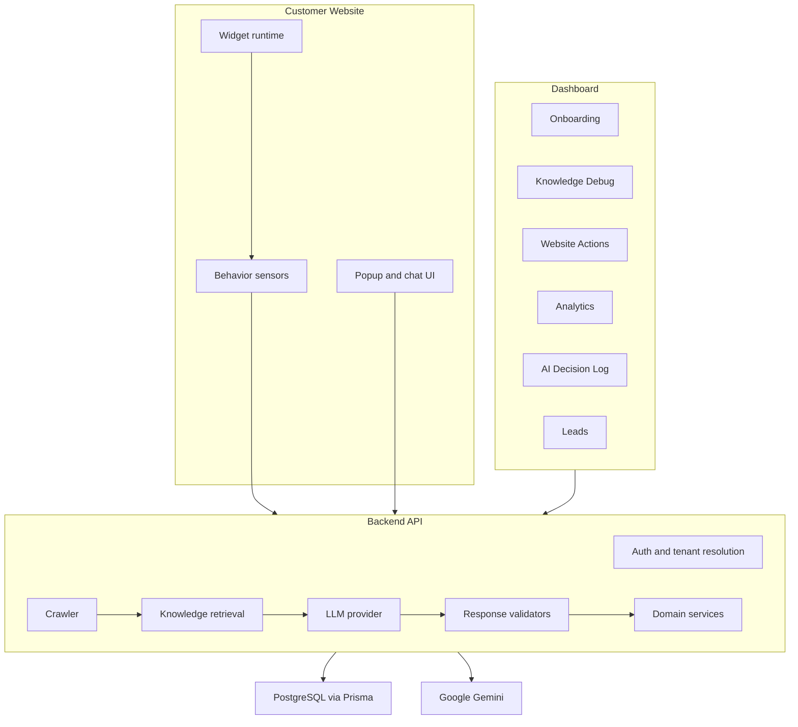

# Developer Guide

AI Revenue Employee is a full-stack SaaS product for turning a business website into an AI-assisted revenue channel. It combines website knowledge, visitor behavior, proactive chat, lead capture, analytics, and a lightweight embeddable widget.

## What Problem It Solves

Most websites lose high-intent visitors because static pages cannot react to behavior in real time. This project gives a business an AI assistant that understands the site, notices visitor intent, starts relevant conversations, recommends useful actions, and captures leads without requiring the website owner to rebuild their site.

## System Architecture

The dashboard and widget never own core intelligence. They collect user input and display results. The backend owns tenant resolution, knowledge retrieval, prompt construction, LLM calls, validation, persistence, and analytics.

## Backend Flow

1. A dashboard or widget request reaches the Express API.
2. Middleware validates input, handles cookies/CORS, and resolves the tenant from website identifiers or origins.
3. Domain services load website configuration, knowledge, business actions, visitor context, and analytics state.
4. Prompt builders create constrained prompts for chat, engagement, lead capture, popup generation, or website actions.
5. The LLM provider calls Gemini and returns structured output.
6. Validators clamp unsafe or malformed responses into a safe backend-owned contract.
7. Services persist decisions, events, leads, conversations, and analytics.
8. The API returns a compact response to the dashboard or widget.

Important backend areas:

- `backend/src/routes/` exposes API entry points.
- `backend/src/services/` coordinates chat, engage, ingest, and business workflows.
- `backend/src/context/` prepares retrieval context.
- `backend/src/prompts/` builds model prompts.
- `backend/src/validation/` validates model and API responses.
- `backend/src/analytics/` records and reads analytics data.
- `backend/src/leads/` handles lead capture.
- `backend/src/business-actions/` discovers and manages website actions.
- `backend/src/widgets/` supports widget configuration and snippets.

## Frontend Flow

The dashboard is a Next.js App Router application. It provides authenticated screens for onboarding, websites, analytics, conversations, business actions, leads, settings, knowledge debugging, and decision logs.

Typical dashboard flow:

1. User signs up or logs in.
2. User adds a website during onboarding.
3. Dashboard calls backend APIs through `dashboard/src/lib/api.ts`.
4. Backend creates website records and runs knowledge workflows.
5. Dashboard pages render state returned from backend services.
6. User copies the widget snippet and installs it on the target website.

Frontend areas:

- `dashboard/src/app/(auth)/` contains login and signup screens.
- `dashboard/src/app/(dashboard)/` contains authenticated product screens.
- `dashboard/src/components/` contains shared dashboard UI.
- `dashboard/src/lib/auth-context.tsx` manages frontend auth state.
- `dashboard/src/lib/api.ts` centralizes API requests.

## Knowledge Build Flow

Knowledge Build turns a website into retrievable context for AI responses.

1. The dashboard submits a website URL.
2. Backend crawler fetches pages within configured limits.
3. Extracted text is normalized and chunked.
4. Gemini embeddings are generated for knowledge chunks.
5. The knowledge index is stored for retrieval.
6. Chat, popup, and action prompts retrieve relevant chunks using visitor intent and conversation context.
7. Knowledge Debug pages help inspect what the assistant can see.

Configuration is controlled with variables such as `CRAWL_MAX_PAGES`, `CRAWL_CONCURRENCY`, `RETRIEVAL_TOP_K`, `RETRIEVAL_MIN_SCORE`, and `RETRIEVAL_MAX_CONTEXT_CHARS`.

## AI Chat Flow

1. Visitor sends a message through the widget chat UI.
2. Widget sends conversation state and visitor context to the backend.
3. Backend resolves the website tenant and retrieves relevant knowledge.
4. Prompt builder creates a grounded chat prompt.
5. Gemini generates an answer.
6. Response validation ensures the reply is safe, structured, and suitable for the widget.
7. Backend streams or returns the response and records analytics.

The chat flow is designed to answer from business knowledge first and avoid putting raw model behavior directly in the browser.

## Lead Capture Flow

1. Widget and backend detect high-intent behavior or chat context.
2. Backend decides whether lead capture is appropriate.
3. Widget renders inline lead capture UI or a popup path.
4. Visitor submits contact information.
5. Backend validates and stores the lead.
6. Dashboard displays captured leads for follow-up.
7. Analytics records the conversion path.

Lead capture should remain consent-based and should never expose secrets or raw debug context to the visitor.

## Widget Flow

The widget is a standalone TypeScript bundle built with esbuild.

1. Business installs a script tag on its website.
2. Widget initializes with a site or website identifier.
3. Sensors collect page and behavior signals.
4. Orchestrator decides when to call backend engagement endpoints.
5. Backend returns popup, chat, lead, or action decisions.
6. Widget renders UI without owning business logic.
7. Widget sends analytics events back to the backend.

The generated bundle is written to `backend/public/widget.js` for serving from the API host. The bundle is ignored in Git because it is a build artifact.

## Safety Principles

- Keep secrets in environment variables, never in source files.
- Keep generated artifacts out of commits.
- Keep model output behind backend validators.
- Treat widget input as untrusted.
- Keep CORS allowlists explicit in production.
- Run build checks before pushing deployment changes.
